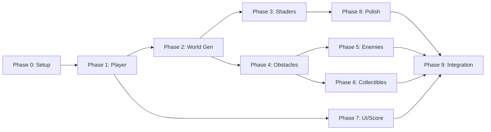

# Runner Game MVP — Implementation Plan

> **Endless 3D Auto-Runner**: City theme, 3 lanes, primitives + shaders, obstacles, enemies, coins, power-ups. PC.

---

## 🏛 Architecture Overview

### Core Systems
*   **Game Loop**: Controlled by `GameManager` (Singleton). State Machine: `Menu` → `Playing` → `GameOver`.
    *   *Why*: Centralized state management prevents race conditions between spawners and player logic.
*   **Input**: `UnityEngine.InputSystem` polling in `Update()`.
    *   *Why*: Direct polling (`wasPressedThisFrame`) is simpler for single-frame trigger actions (Jump, Slide) than event callbacks, reducing delegate overhead for core mechanics.
*   **Physics**: `CharacterController` (Kinematic) vs `Rigidbody`.
    *   *Why*: Endless runners require precise, snappy movement. `Rigidbody` physics introduces inertia, friction, and potential tunneling at high speeds. `CharacterController` provides absolute control over velocity and collision handling.

### World Generation ("Treadmill")
*   **Logic**: `ChunkSpawner` maintains a list of `activeChunks`. Spawns ahead based on Player Z position.
*   **Coordinate System**: Player acts as the moving reference frame (Index-based generation).
    *   *Why*: Moving the player (instead of moving the world around a stationary player) simplifies physics and navmesh calculations initially. *Note: May require Floating Origin solution if run distance exceeds ~50km (float precision limit).*

---

## 🔢 Configuration Snapshot (Reproducibility)
**Critical for reproducing game feel.** Values taken from `RunnerSettings.asset`.

| Setting | Value | Script |
| :--- | :--- | :--- |
| **Run Speed** | `20` units/sec | `RunnerSettings.cs` |
| **Jump Force** | `12` | `PlayerRunner.cs` |
| **Gravity Mult** | `2.5` | `PlayerRunner.cs` |
| **Lane Width** | `3` units | `PlayerRunner.cs` |
| **Slide Duration** | `0.8` sec | `PlayerRunner.cs` |
| **Slide Height** | `1.0` units | `PlayerRunner.cs` |
| **Chunk Length** | `50` units | `ChunkSpawner.cs` |
| **Chunks Ahead** | `3` | `ChunkSpawner.cs` |

---

## Phase 0: Project Setup ✅
**Goal**: Foundation and folder structure

- [x] Create `RunnerScene.unity`
- [x] Create folder structure
- [x] Create `RunnerSettings.asset` (ScriptableObject for tuning)

---

## Phase 0.5: Prefab System ✅
**Goal**: All dynamic objects as editable prefabs

### Folder Structure
```
Assets/Prefabs/ ...
```

### Tasks
- [x] Create prefab folder structure
- [x] Create Player prefab (from current scene object)
- [x] Create Obstacle prefabs (Barrier_Low, Barrier_High, Car)
- [x] Create Enemy prefabs (Ground, Air)
- [x] Create Collectible prefabs (Coin, 4 PowerUp types)
- [x] Create World prefabs (Chunk, Buildings, StreetLight)
- [x] Update all spawners to use prefabs instead of `CreatePrimitive()`
- [x] Auto-assign prefabs via `PrefabSetupUtility.cs`
- [x] Auto-assign materials via `MaterialSetupUtility.cs`
- [x] Test all spawning systems with new prefabs

### ✅ Phase 0.5 Complete
- 15 prefabs created and configured
- 11 materials created with distinct colors
- Editor utilities auto-run on domain reload
- All spawners use prefab references

---

## Phase 1: Core Player Movement ✅
**Goal**: Player runs forward, switches lanes, jumps

### 1.1 Basic Forward Motion
*   **Implementation**: `PlayerRunner.cs` applies constant Z velocity.
*   **Detail**: `EffectiveSpeed` calculated in `GameManager` (Base + Difficulty Curve + PowerUps) and read by Player.
- [x] `PlayerRunner.cs` — auto-move forward at constant speed
- [x] Camera follows player (fixed offset behind) — `RunnerCamera.cs`

### 1.2 Lane Switching
*   **Implementation**: Discrete 3-lane system (`-1`, `0`, `1` indices).
*   **Math**: `TargetX = LaneIndex * LaneWidth`. Movement is smoothed via `Mathf.MoveTowards` (Linear) or `Mathf.SmoothDamp` (Ease-out).
- [x] 3 lanes: Left (-3), Center (0), Right (+3)
- [x] Input: A/D or ←/→ to switch lanes
- [x] Smooth interpolation between lanes (MoveTowards in `PlayerRunner.cs`)

### 1.3 Free X Movement (Hybrid)
*   **Mechanic**: Allows fine-tuning position within a lane to dodge narrow obstacles.
- [x] Hold A/D for continuous side movement within lane bounds — `PlayerRunner.cs`
- [x] Clamp X position to ±4 units

### 1.4 Jump & Slide
*   **Jump Logic**: `VerticalVelocity` calculation. `v = sqrt(2 * gravity * height)`.
*   **Slide Logic**: Collider Resizing with Center Adjustment to keep feet on ground.
- [x] Space = Jump (physics or curve-based) — `PlayerRunner.HandleJump`
- [x] Ctrl/S = Slide (shrink collider, timer-based) — `PlayerRunner.HandleSlide`
- [x] Grounded check via raycast (`CharacterController.isGrounded`)

---

## Phase 2: Procedural World Generation ✅
**Goal**: Infinite scrolling city from primitives

### 2.1 Chunk System Architecture
*   **Strategy**: "Pool and Recycle". `ChunkSpawner` spawns ahead of Player Z.
- [x] `ChunkData.cs` — ScriptableObject defining chunk layout
- [x] `Chunk.cs` — MonoBehaviour, poolable chunk prefab
- [x] `ChunkSpawner.cs` — spawns chunks ahead, despawns behind

### 2.2 Ground Chunks
- [x] Road segment (Plane/Cube stretched) — in `ChunkSpawner.CreateProceduralChunk`
- [x] 3 lane markers (thin cubes or lines)
- [x] Chunk length: 50 units

### 2.3 City Decoration (Primitives)
*   **Optimization**: Runtime Instantiation logic in `ChunkSpawner`.
- [x] Buildings: Cubes of varying height (10-50 units)
- [x] Randomized left/right placement
- [x] Street lights: Cylinder + Sphere
- [x] Optional: Barriers, fences (small cubes)

### 2.4 Object Pooling
*   **Requirement**: `Instantiate` causes Garbage Collection spikes.
- [x] `ObjectPool<T>` generic pooler — `ObjectPool.cs`
- [x] Pool: Chunks, Buildings, Street objects

---

## Phase 3: Shaders & Visual Style 🎨 (Completed)
**Goal**: Create a readable "Premium" aesthetic (Matte + Glow).

### 3.1 Global Effects
- [x] ~~**Curved World Shader**~~: **CANCELLED**.
- [x] **Procedural Skybox**: Dynamic gradient with procedural flickering neon stars.
- [x] **Global Volume**: Bloom, Chromatic Aberration, ACES Tonemapping.

### 3.2 Environmental Shaders
- [x] **Matte Black Road**: Smooth matte surface with blue sheen.
- [x] **Building Facades**: World Space UVs, Windows, Rim Light.

### 3.3 Object Shaders
- [x] **Opaque Obstacles**: Solid color with inner Rim Outline and Glow.
- [x] **Player Material**: Blue Glitch shader.
- [x] **Collectible Glow**: Pulsing emission.

### 3.4 Post-Processing
- [x] **Bloom**: Essential for the neon glow.
- [x] **Chromatic Aberration**: Subtle lens distortion at edges.
- [x] **Color Grading**: High contrast, cool blue/purple tints.

---

## Phase 4: Obstacles (Static) ✅
**Goal**: Things player must avoid

### 4.1 Obstacle Types
- [x] Barrier (low) — Jump over
- [x] Barrier (high) — Slide under
- [x] Car (stationary) — Lane block

### 4.2 Obstacle Spawning
*   **Logic**: Spawned *within* Chunks via `ObstacleSpawner.cs`.
*   **Density Algorithm**: `Lerp` chance based on distance.
- [x] `ObstacleSpawner.cs` — places obstacles on chunks
- [x] Difficulty curve: more obstacles over time/distance — `TrySpawnObstacle`
- [x] Minimum spacing rules (no impossible combos)

### 4.3 Collision & Death
*   **Implementation**: `OnTriggerEnter` in `PlayerRunner`.
- [x] Player has trigger collider
- [x] Obstacle collision → GameOver state — `PlayerRunner.Die`

---

## Phase 5: Enemies ✅
**Goal**: Moving threats

### 5.1 Ground Enemies
- [x] `EnemyGround.cs` — patrols single lane (PingPong movement)
- [x] Visual: Capsule/Cube with eyes (placeholder)
- [x] Collision = death

### 5.2 Air Enemies
- [x] `EnemyAir.cs` — flies at head height
- [x] Avoid by: Slide OR lane switch
- [x] Moves side-to-side (Implemented in base/air logic?)

### 5.3 Enemy Spawning
- [x] Spawn on chunks like obstacles — `EnemySpawner.cs`
- [x] Rarer than static obstacles (Lower spawn chance configured)

---

## Phase 6: Collectibles ✅
**Goal**: Coins and power-ups

### 6.1 Coins ✅
- [x] `Coin.cs` — trigger, +10 score
- [x] Visual: Cylinder rotating (or Sphere)
- [x] Spawn in patterns: lines, arcs, zigzags — `CollectibleSpawner.cs`
- [x] VFX: Pickup particle, sound

### 6.2 Power-Ups ✅
| Power-Up | Effect | Duration | Status |
|----------|--------|----------|--------|
| Magnet | Auto-collect coins | 5s | ✅ Fixed |
| Shield | Ignore 1 hit | Until used | ✅ |
| 2x Score | Double points | 10s | ✅ |
| Speed Boost | Faster running | 3s | ✅ |

- [x] `PowerUp.cs` — base class
- [x] `PowerUpManager.cs` — active effects, timers
- [x] Visual: Glowing cube/sphere per type
- [x] `PowerUpOrbitEffect.cs` — visual orbit cubes around player

---

## Phase 7: Scoring & UI ✅
**Goal**: HUD and game flow

### 7.1 Separation of Concerns (MVC)
*   **Model**: `ScoreManager` (Data: Score, HighScore, Coins).
*   **View**: `HUDView`, `GameOverView` (Pure visual updates).
*   **Controller**: `GameManager` (Orchestrates flow).

### 7.2 UI Implementation
- [x] `ScoreManager.cs` — distance & coin calculation
- [x] UI Controller (Menu, HUD, Game Over) — `StartMenuUI.cs`, `GameOverUI.cs`, `HUD.cs`
- [x] Simple text HUD (Distance, Coins)
- [x] **Main Menu**:
    - [x] Start Game (Pulse animation) — `UIAnimator.cs`
- [x] **Game Over**:
    - [x] Score Count-up Animation — in `GameOverUI.cs`
    - [x] "Restart" Instant Action
    - [x] High Score visual flair

### 7.4 Micro-Interactions & feedback
- [x] **Hover Effects**: Scale up (`scale: 1.05`) + Border Glow transition
- [x] **Click Feedback**: Sound + Visual "Press" (`scale: 0.95`)

### Lessons Learned (UI Rebuild)
1.  **Logic Continuity**: Scripts must live on always-active GameObjects; only toggle minimal visual children.
2.  **Layout Geometry**: Programmatic layout requires strict `Anchor == Pivot` alignment to prevent off-screen clipping.


---

## Phase 8: Game Feel & Polish 🚧
**Goal**: Juice and responsiveness

### 8.1 Camera Effects
- [x] Slight FOV increase with speed
- [x] Screen shake on death
- [x] Smooth follow with dampening

### 8.2 Player Feedback
- [x] Lane switch: quick tilt animation (SmoothDamp)
- [x] Jump: squash & stretch
- [x] Slide: squash visual (NEW)
- [x] Death: explosion VFX
- [x] Player trail (Fixed visibility & color)

### 8.4 Difficulty Progression
*   **Curve**: `Speed = BaseSpeed + log(Distance)`.
- [x] Speed increases over time (cap at max) — `GameManager.cs`
- [x] More obstacles/enemies at higher distances — `ObstacleSpawner.cs`

---

## Phase 9: Integration & Testing 🚧
**Goal**: Everything works together

- [ ] Full playthrough: start → run → die → restart
- [ ] Balance: speed curve, obstacle density
- [ ] Performance: check pooling, no GC spikes
- [ ] Input: verify all controls responsive

---

## Execution Order (Recommended)



---

## File List (Estimated)

| Category | Files |
|----------|-------|
| **Core** | `GameManager.cs`, `ScoreManager.cs`, `RunnerSettings.cs` |
| **Player** | `PlayerRunner.cs`, `PlayerInput.cs`, `PlayerCollision.cs` |
| **World** | `ChunkSpawner.cs`, `Chunk.cs`, `ChunkData.cs`, `ObjectPool.cs` |
| **Obstacles** | `Obstacle.cs`, `ObstacleSpawner.cs` |
| **Enemies** | `EnemyBase.cs`, `EnemyGround.cs`, `EnemyAir.cs` |
| **Collectibles** | `Coin.cs`, `PowerUp.cs`, `PowerUpManager.cs` |
| **UI** | `HUD.cs`, `GameOverUI.cs`, `MainMenuUI.cs` |
| **Shaders** | `CityBuilding.shadergraph`, `Road.shadergraph` |
| **Data** | `RunnerSettings.asset`, `ChunkData_*.asset` |

---
