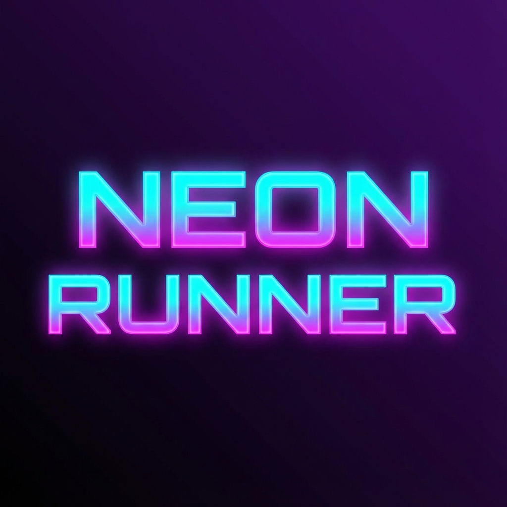
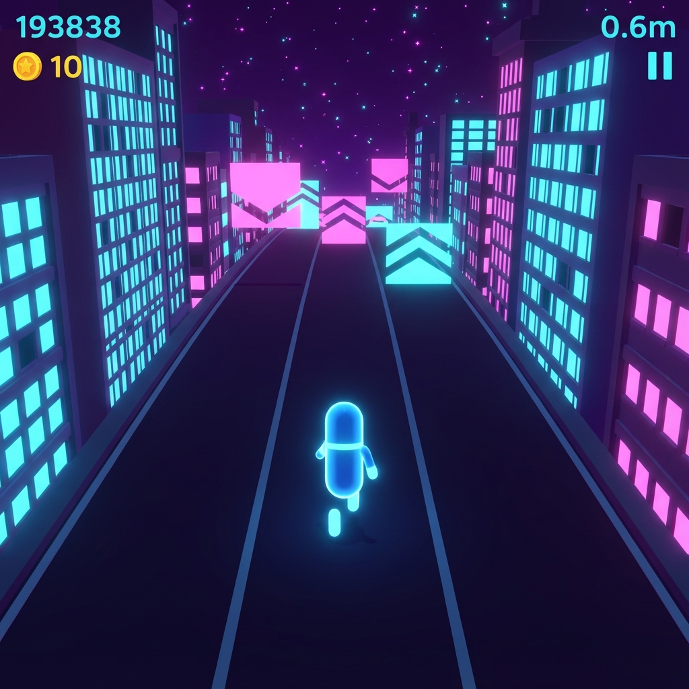

# 🏃 Neon Runner


*Logo (Mockup)*

> A stylish **endless 3D auto-runner** built with Unity 6. Cyberpunk city, neon aesthetics, procedural generation.


*Gameplay (Mockup — AI-generated concept)*

---

## ✨ Features

- **Infinite Procedural World**: Chunks spawn ahead, despawn behind. Randomized buildings and decorations.
- **3-Lane Gameplay**: Swipe or press A/D to switch lanes.
- **Jump & Slide**: Dodge obstacles with snappy, physics-based movement.
- **Power-Ups**: Magnet, Shield, 2x Score, Speed Boost.
- **Neon Visual Style**: Custom shaders, Bloom, procedural Skybox.
- **Difficulty Curve**: Speed increases over distance.

---

## 🎮 Controls

| Action | Key |
|--------|-----|
| Move Left | `A` / `←` |
| Move Right | `D` / `→` |
| Jump | `Space` |
| Slide | `Ctrl` / `S` |
| Start / Restart | `Space` |

---

## 🛠️ Tech Stack

- **Engine**: Unity 6.x (URP)
- **Input**: New Input System
- **Physics**: CharacterController (Kinematic)
- **Shaders**: ShaderGraph (URP Lit + Custom)
- **Scripting**: C# (No external dependencies)

---

## 📁 Project Structure

```
Assets/
├── Scripts/
│   ├── Runner/           # Core gameplay
│   │   ├── Core/         # GameManager, ScoreManager
│   │   ├── Player/       # PlayerRunner, Camera
│   │   ├── World/        # ChunkSpawner, ObjectPool
│   │   ├── Obstacles/    # Obstacle, Enemy scripts
│   │   ├── Collectibles/ # Coin, PowerUp
│   │   ├── UI/           # HUD, Menus
│   │   └── VFX/          # Visual effects
│   └── Editor/           # Automation utilities
├── Prefabs/              # All spawnable objects
├── Materials/            # Shaders and materials
├── Scenes/               # RunnerScene.unity
├── Data/                 # ScriptableObjects (RunnerSettings)
└── Plans/                # Implementation documentation
```

---

## 🚀 Getting Started

1. **Clone the repository**
   ```bash
   git clone https://github.com/YOUR_USERNAME/neon-runner.git
   ```

2. **Open in Unity Hub**
   - Unity version: **6.x** (LTS recommended)
   - Render Pipeline: **URP**

3. **Open the Scene**
   - `Assets/Scenes/RunnerScene.unity`

4. **Play!** 🎮

---

## 📊 Configuration

All gameplay tuning is centralized in `Assets/Data/RunnerSettings.asset`:

| Setting | Default | Description |
|---------|---------|-------------|
| Run Speed | 20 | Forward speed (units/sec) |
| Jump Force | 12 | Initial jump velocity |
| Gravity Mult | 2.5 | Makes jumps snappier |
| Lane Width | 3 | Distance between lanes |
| Slide Duration | 0.8s | How long slide lasts |
| Chunk Length | 50 | Length of each world chunk |

---

## 📝 Implementation Plan

See [Runner_ImplementationPlan.md](Assets/Plans/Runner_ImplementationPlan.md) for detailed architecture, design decisions, and lessons learned.

---

## 📜 License

MIT License. See [LICENSE](LICENSE) for details.

---

## 🙏 Credits

- Built with [Unity](https://unity.com/)
- Inspired by Subway Surfers, Temple Run, and synthwave aesthetics

---

*Made with ❤️ and AI assistance*
